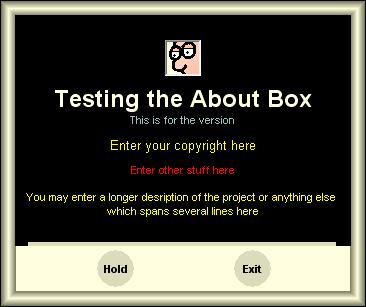



## Animated About Box \(Update \#1 now has curtains\)

### Description

Okay, I give in... This is a nice and easy to use animated (scrolling - flickerfree!) About Box with quite a number of color themes. Shows how to make standard command buttons round and a few other goodies. Just add it to your project, set a few properties and you are GO. How-To is included in the code. Try it, download is only 7 kB.
 
### More Info
 
Makes addictive, be warned.

             |
---                |---
**Submitted On**   |2006-03-26 12:30:02
**By**             |[ULLI](https://github.com/Planet-Source-Code/PSCIndex/blob/master/ByAuthor/ulli.md)
**Level**          |Intermediate
**User Rating**    |4.8 (24 globes from 5 users)
**Compatibility**  |VB 6\.0
**Category**       |[Custom Controls/ Forms/  Menus](https://github.com/Planet-Source-Code/PSCIndex/blob/master/ByCategory/custom-controls-forms-menus__1-4.md)
**World**          |[Visual Basic](https://github.com/Planet-Source-Code/PSCIndex/blob/master/ByWorld/visual-basic.md)
**Archive File**   |[Animated\_A1983253262006\.zip](https://github.com/Planet-Source-Code/ulli-animated-about-box-update-1-now-has-curtains__1-64818/archive/master.zip)

